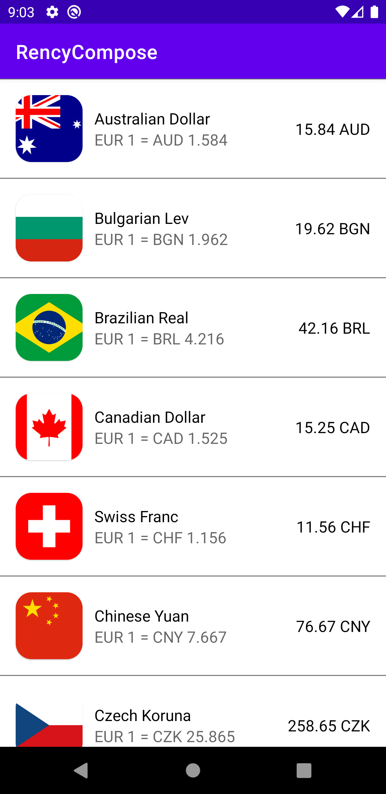

##### A very simple Android project built to play around with the following concepts:

* Jetpack Compose
* Dagger Hilt
* Retrofit w/ Moshi
* Using suspend functions / flows from the ViewModel layers to the Repository layer
* StateFlow for the UI layer to react to the data changes

###### Consumes the Revolut API to receive currency exchange rates and display them in real time.

